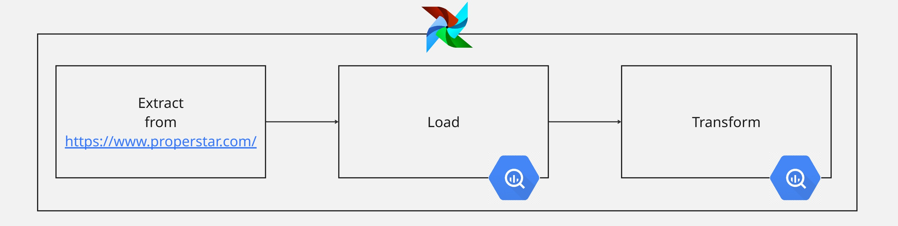

# 🗝️ Extract Load Transform Using Airflow

This **ELT** (Extract Load Transform) pipeline using Apache Airflow to scrape property data from [Properstar](https://www.properstar.com/), load it into BigQuery, and transform the data with SQL.

## 🔗Pipeline Overview


**`extract_task` >> `load_task` >> `transform_task`**
## ⛓️ Task Dependencies

- **`extract_task` → `load_task`**
  - `extract_task` is the **upstream** of `load_task`
  - `load_task` is the **downstream** of `extract_task`

- **`load_task` → `transform_task`**
  - `load_task` is the **upstream** of `transform_task`
  - `transform_task` is the **downstream** of `load_task`

Each task only runs after its upstream task has completed successfully. This ensures the data flows smoothly and consistently from extraction, through loading, and into the transformation phase.
### 🔗Extract
  The `extract_task` performs **web scraping** from [Properstar](https://www.properstar.com/), a property listing site that offers various types of real estate, such as houses, apartments, and villas.

- Scrapes property data (raw) including:
  <table border="1">
  <thead>
    <tr>
      <th>Property Attribute</th>
      <th>Description</th>
    </tr>
  </thead>
  <tbody>
    <tr>
      <td>Country</td>
      <td>The country where the property is located.</td>
    </tr>
    <tr>
      <td>Link</td>
      <td>Direct URL to the property listing.</td>
    </tr>
    <tr>
      <td>Name</td>
      <td>Name or title of the property.</td>
    </tr>
    <tr>
      <td>Address</td>
      <td>Full address of the property.</td>
    </tr>
    <tr>
      <td>Price</td>
      <td>Listing price of the property.</td>
    </tr>
    <tr>
      <td>Bedrooms</td>
      <td>Number of bedrooms in the property.</td>
    </tr>
    <tr>
      <td>Bathrooms</td>
      <td>Number of bathrooms in the property.</td>
    </tr>
    <tr>
      <td>Living area</td>
      <td>Size of the living area in square meters.</td>
    </tr>
    <tr>
      <td>Land</td>
      <td>Size of the land in square meters or hectares.</td>
    </tr>
    <tr>
      <td>Energy efficiency rating</td>
      <td>Rating for the energy efficiency of the property.</td>
    </tr>
    <tr>
      <td>Amenities</td>
      <td>List of property amenities (e.g., swimming pool, gym, etc.).</td>
    </tr>
    <tr>
      <td>View</td>
      <td>The type of view available from the property (e.g., sea view, city view).</td>
    </tr>
    <tr>
      <td>Rooms</td>
      <td>Total number of rooms in the property.</td>
    </tr>
    <tr>
      <td>Balconies</td>
      <td>Number of balconies available in the property.</td>
    </tr>
    <tr>
      <td>Internal</td>
      <td>Internal features (e.g., flooring, walls).</td>
    </tr>
    <tr>
      <td>Toilet rooms</td>
      <td>Number of separate toilet rooms.</td>
    </tr>
    <tr>
      <td>Type</td>
      <td>Type of property (e.g., apartment, house, villa).</td>
    </tr>
    <tr>
      <td>Construction year</td>
      <td>Year the property was constructed.</td>
    </tr>
    <tr>
      <td>Floors</td>
      <td>Number of floors in the building or property.</td>
    </tr>
    <tr>
      <td>Total</td>
      <td>Total area of the property or the total number of rooms, etc.</td>
    </tr>
    <tr>
      <td>Condition</td>
      <td>Current condition of the property (e.g., new, renovated, needs work).</td>
    </tr>
    <tr>
      <td>Standing</td>
      <td>The legal status of the property (e.g., freehold, leasehold).</td>
    </tr>
    <tr>
      <td>Heating</td>
      <td>Type of heating system in the property.</td>
    </tr>
    <tr>
      <td>Hot water</td>
      <td>Type of hot water system.</td>
    </tr>
    <tr>
      <td>Hot water waste</td>
      <td>Efficiency or system used to manage hot water waste.</td>
    </tr>
    <tr>
      <td>Usable</td>
      <td>Usable area of the property.</td>
    </tr>
    <tr>
      <td>Renovation year</td>
      <td>Year when the property was last renovated (if applicable).</td>
    </tr>
    <tr>
      <td>Environment</td>
      <td>Environmental factors or certifications related to the property.</td>
    </tr>
    <tr>
      <td>Terrace</td>
      <td>Whether there is a terrace or roof space.</td>
    </tr>
    <tr>
      <td>Terraces</td>
      <td>Number of terraces in the property.</td>
    </tr>
    <tr>
      <td>Garden</td>
      <td>Information about the garden area.</td>
    </tr>
    <tr>
      <td>Construction type</td>
      <td>Type of construction used (e.g., brick, wood, steel).</td>
    </tr>
    <tr>
      <td>Flats</td>
      <td>Number of flats available or in the property.</td>
    </tr>
    <tr>
      <td>Offices</td>
      <td>Number of office spaces if applicable.</td>
    </tr>
    <tr>
      <td>Balcony</td>
      <td>Information about the balcony (size, number, etc.).</td>
    </tr>
    <tr>
      <td>Carports</td>
      <td>Number of carports available for the property.</td>
    </tr>
    <tr>
      <td>Shower rooms</td>
      <td>Number of shower rooms.</td>
    </tr>
    <tr>
      <td>Cellar</td>
      <td>Whether there is a cellar or basement.</td>
    </tr>
    <tr>
      <td>Flat</td>
      <td>If the property is a flat, details regarding it.</td>
    </tr>
    <tr>
      <td>Environmental carbon dioxide impact rating</td>
      <td>CO2 impact rating of the property.</td>
    </tr>
    <tr>
      <td>Parking lots inside</td>
      <td>Number of parking lots available inside the property or garage.</td>
    </tr>
    <tr>
      <td>Parking lots Outside</td>
      <td>Number of parking spaces outside the property.</td>
    </tr>
  </tbody>
</table>

### 🔗Load
  **`load_task`** is responsible for loading the extracted data from extract_task into Google BigQuery. The raw data is inserted into the specified BigQuery table, preparing it for the next transformation stage.
### 🔗Transform
**`transform_task`** is responsible for transforming the raw data loaded into BigQuery. At this stage, the data is processed using SQL to clean, filter, and modify it to make it ready for further analysis.

Common tasks in **`transform_task`** include:
- **Filtering**: Removing unnecessary data.
- **Aggregation**: Summing or averaging values for analysis.
- **Normalization**: Standardizing the format or scale of the data.

This transformation step prepares the data for use in reporting, visualization, or further analysis.
## Installation
**Clone the Repository:**
   ```bash
   git clone https://github.com/rosaihzaa/simple-airflow-pipeline.git
   ```
**Create a Virtual Environment:**
   ```bash
   python -m venv venv
   source venv/bin/activate  
   ```
**Install Dependencies:**
   ```bash
   pip install -r requirements.txt
   ```
**Set up Google Cloud Authentication:**
   ```bash
   gcloud auth activate-service-account --key-file=your-service-account-key.json
   ```
**Install Apache Airflow:**
   ```bash
   pip install apache-airflow
   ```
**Initialize Airflow Database:**
   ```bash
   airflow db init
   ```
**Start Airflow:**
   Run the Airflow web server and scheduler.
   ```bash
   airflow webserver --port 8080
   airflow scheduler
   ```
After these steps, the pipeline should be ready to run. You can monitor and trigger the DAG from the Airflow web UI at [http://localhost:8080](http://localhost:8080).
